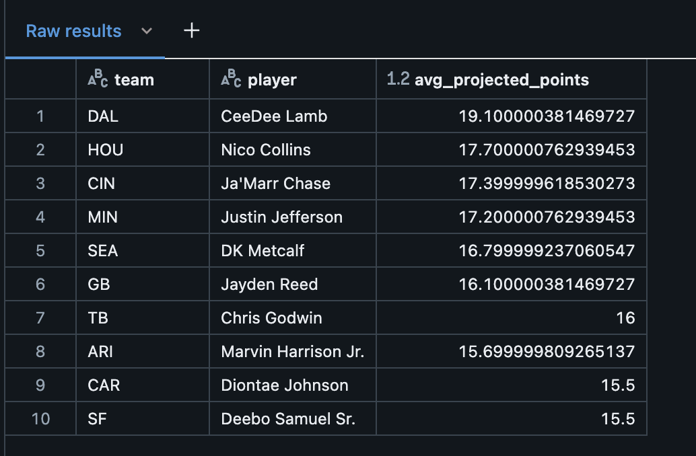

# Danish_Maknojia_MP7

[](https://github.com/nogibjj/Maknojia_Danish_MP7/actions/workflows/cicd.yml)

## Project Overview
This project is a python script which interacts with a cloud-based SQL server on Databricks. The project requires us to build an ETL pipeline (Extract, Transform & Load) and focus on creating a complex SQL query. The CLI tool makes it easy to perform the ETL commands:

- Extract: Raw data is accessed via github repo

- Transform & Load: Reads data from a CSV file, processes it, and loads it into a local SQLite3 database named WRRankingDB.db.

- Query: Performs CRUD operations (create, read, update, delete) on the database, and logging each SQL query to a markdown file (query_log.md). The log_query function appends the executed SQL queries to the log file, while general_query, create_record, update_record, delete_record, and read_data manage data operations within the database.

- Complex SQL Query: Running a query on the tables in the database which joins tables and provides valuable insights

## CLI Use

```
python setup.py develop
```
This command allows use to setup the command line CLI functions

Functions:

```
etl_query <command>
```
Format to run the etl_query commands

```
etl_query extract
```
Extracts data
```
etl_query load
```
Loads data
```
etl_query query"""

WITH player_stats AS (
    SELECT '2024' AS season,
        p.PLAYER_NAME AS player,
        r.TEAM AS team,
        r.OPP AS opponent,
        p.PROJ_FPTS AS projected_points
    FROM drm85_mp6.drm85_wr_points p
    JOIN drm85_mp6.drm85_wr_ranking r ON p.PLAYER_NAME = r.PLAYER_NAME
    WHERE p.PROJ_FPTS IS NOT NULL
),
team_player_stats AS (
    SELECT team,
        player,
        AVG(projected_points) AS avg_projected_points
    FROM player_stats
    GROUP BY team, player
)

SELECT team, player, avg_projected_points
FROM team_player_stats
ORDER BY avg_projected_points DESC
LIMIT 10;


""""
```
Runs complex query on data 

## Directory Overview

```
├── Makefile
├── README.md
├── WRRankingDB.db
├── __pycache__
│   └── test.cpython-312-pytest-7.4.0.pyc
├── complexQueryLog.md
├── data
│   ├── WRRankingsWeek5Points.csv
│   └── WRRankingsWeek5Ranking.csv
├── lib
│   ├── __init__.py
│   ├── __pycache__
│   │   ├── __init__.cpython-312.pyc
│   │   ├── extract.cpython-312.pyc
│   │   ├── query.cpython-312.pyc
│   │   └── transform_load.cpython-312.pyc
│   ├── extract.py
│   ├── query.py
│   └── transform_load.py
├── main.py
├── query_log.md
├── requirement.txt
└── test.py

```

## Complex Query 
```sql
WITH player_stats AS (
    SELECT '2024' AS season,
        p.PLAYER_NAME AS player,
        r.TEAM AS team,
        r.OPP AS opponent,
        p.PROJ_FPTS AS projected_points
    FROM drm85_mp6.drm85_wr_points p
    JOIN drm85_mp6.drm85_wr_ranking r ON p.PLAYER_NAME = r.PLAYER_NAME
    WHERE p.PROJ_FPTS IS NOT NULL
),
team_player_stats AS (
    SELECT team,
        player,
        AVG(projected_points) AS avg_projected_points
    FROM player_stats
    GROUP BY team, player
)

SELECT team, player, avg_projected_points
FROM team_player_stats
ORDER BY avg_projected_points DESC
LIMIT 10;

```
This query calculates the average projected fantasy points for players in the 2024 season and combines it with data from previous seasons.
It first extracts player statistics and their respective teams, then calculates the average projected points for each player grouped by their team.
The results are sorted in descending order to display the top 10 players with the highest average projected points.

## Output

```text
[Row(team='DAL', player='CeeDee Lamb', avg_projected_points=19.10),
 Row(team='HOU', player='Nico Collins', avg_projected_points=17.70),
 Row(team='CIN', player="Ja'Marr Chase", avg_projected_points=17.40),
 Row(team='MIN', player='Justin Jefferson', avg_projected_points=17.20),
 Row(team='SEA', player='DK Metcalf', avg_projected_points=16.80),
 Row(team='GB', player='Jayden Reed', avg_projected_points=16.10),
 Row(team='TB', player='Chris Godwin', avg_projected_points=16.00),
 Row(team='ARI', player='Marvin Harrison Jr.', avg_projected_points=15.70),
 Row(team='SF', player='Deebo Samuel Sr.', avg_projected_points=15.50),
 Row(team='CAR', player='Diontae Johnson', avg_projected_points=15.50)]
 ```




## CI/CD
1. make all: will test, format, and lint the project

